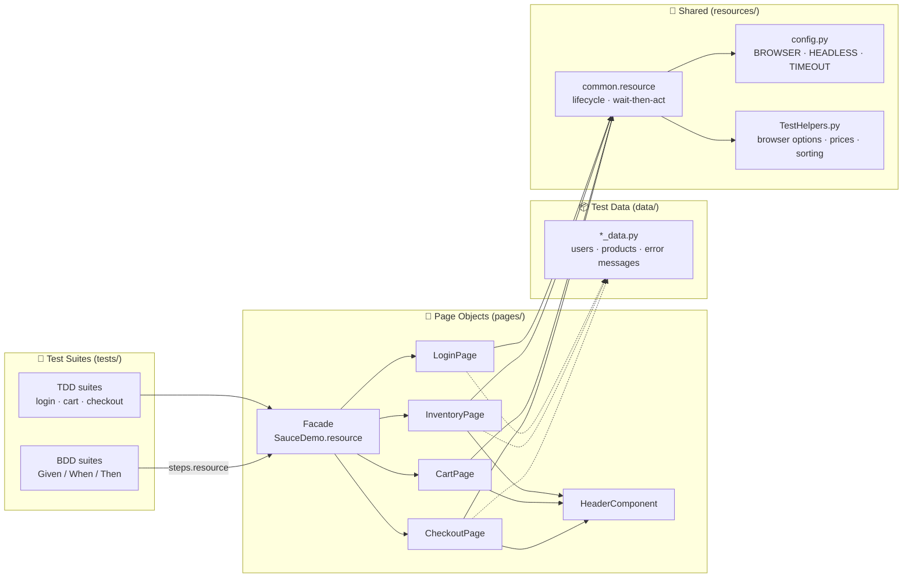

<div align="center">

# 🤖 Robot Framework – Page Object Model

**Web UI test automation with Robot Framework + SeleniumLibrary, built on the Page Object Model (POM).**

[](https://robotframework.org)
[](https://github.com/robotframework/SeleniumLibrary)
[](https://www.selenium.dev)
[](https://www.python.org)
[](https://github.com/MarketSquare/robotframework-robocop)
[](https://pabot.org)
[](#-test-coverage)

[Quick Start](#-quick-start) •
[Architecture](#-architecture) •
[Running Tests](#%EF%B8%8F-running-tests) •
[Test Coverage](#-test-coverage) •
[Adding Tests](#-adding-a-new-page--test) •
[Changelog](#-changelog)

</div>

---

## ⚡ Quick Start

```bash
git clone <repo-url> && cd Robot-Framework
python -m venv .venv
```

<table>
<tr><th>🪟 Windows (PowerShell)</th><th>🐧 Linux / 🍎 macOS</th></tr>
<tr><td>

```powershell
.venv\Scripts\Activate.ps1
pip install -r requirements.txt
robot --argumentfile config/default.args SauceDemo/tests
```

</td><td>

```bash
source .venv/bin/activate
pip install -r requirements.txt
robot --argumentfile config/default.args SauceDemo/tests
```

</td></tr>
</table>

> [!TIP]
> No need to install ChromeDriver or `webdriver-manager`. **Selenium Manager** (built into Selenium ≥ 4.6) downloads the driver that matches your browser automatically.

When the run finishes, open **`results/report.html`** for the summary and **`results/log.html`** for step-by-step details (with a screenshot on every failure).

---

## 🧭 Applications Under Test

| Project | Application | Type | What is tested | Tests |
|---|---|---|---|:---:|
| 🛒 [`SauceDemo/`](SauceDemo) | [saucedemo.com](https://www.saucedemo.com) | Demo / sandbox | Login, catalogue, sorting, cart, E2E checkout, BDD | **29** |
| 🏥 [`HerokuApp/`](HerokuApp) | [CURA Healthcare](https://katalon-demo-cura.herokuapp.com) | Demo / sandbox | Login, appointment matrix (3 × 3), history, menu | **10** |
| 💄 [`BeautyHaul/`](BeautyHaul) | [beautyhaul.com](https://www.beautyhaul.com) | ⚠️ Production | Client-side validation of login & registration | **11** |
| 👗 [`Voila/`](Voila) | [voila.id](https://voila.id) | ⚠️ Production | Sign-in page UI state & identifier validation | **4** |

> [!IMPORTANT]
> **BeautyHaul** and **Voila** are real production sites (BeautyHaul is also protected by reCAPTCHA).
> Their tests **never send a form** to the server: they only check the UI and client-side validation.
> BeautyHaul's `Submit Register Form` has a *safety guard* that clears the birth date and asserts the terms checkbox is unchecked before clicking, so the client-side validator always stops the submit.
> For the same reason the CI pipeline only runs SauceDemo + CURA.

---

## 🏗 Architecture



**Layer rules** (top to bottom, no skipping layers):

1. **Test suites** speak business language only (`Purchase Products`, `Login As Standard User`) and import nothing but the *facade*.
2. **Page Objects** (`*.resource`) keep **locators in `*** Variables ***`** and **page actions + assertions in `*** Keywords ***`**. No locator ever lives in a test file.
3. **Data** lives in `data/*.py`, so users / products / error messages change without touching any logic.
4. **`resources/common.resource`** provides *wait-then-act* wrappers (`Click When Ready`, `Type When Ready`, …), so there are no arbitrary `Sleep`s and every action waits for its element.

<details>
<summary>📁 <b>Full folder structure</b> (click to expand)</summary>

```text
Robot-Framework/
├── .github/workflows/robot-tests.yml   # CI: Robocop lint + headless Pabot run
├── config/
│   ├── default.args                    # shared CLI options (output, log level, xunit…)
│   └── ci.args                         # CI profile: headless + demo apps only
├── resources/                          # ⬅ shared by ALL projects
│   ├── common.resource                 # browser lifecycle, state reset, wait-then-act
│   ├── config.py                       # BROWSER / HEADLESS / TIMEOUT (env-aware)
│   └── libraries/TestHelpers.py        # browser options, price parsing, ordering checks, dates
├── SauceDemo/
│   ├── data/saucedemo_data.py
│   ├── pages/
│   │   ├── SauceDemo.resource          # facade + business flows
│   │   ├── LoginPage.resource
│   │   ├── HeaderComponent.resource    # cart badge + burger menu
│   │   ├── InventoryPage.resource
│   │   ├── CartPage.resource
│   │   └── CheckoutPage.resource
│   └── tests/
│       ├── __init__.robot              # suite name + "saucedemo" tag
│       ├── TDD/  login · inventory · cart · checkout
│       └── BDD/  steps.resource · login · shopping
├── HerokuApp/                          # CURA Healthcare
│   ├── data/cura_data.py
│   ├── pages/  Cura · HomePage · LoginPage · AppointmentPage · HistoryPage
│   └── tests/  login · appointment · history
├── BeautyHaul/
│   ├── data/beautyhaul_data.py
│   ├── pages/  BeautyHaul · LoginPage · RegisterPage · FormValidation
│   └── tests/  login · register
├── Voila/
│   ├── data/voila_data.py
│   ├── pages/LoginPage.resource
│   └── tests/login.robot
├── pyproject.toml                      # Robocop configuration
└── requirements.txt
```

</details>

---

## ▶️ Running Tests

Pick the scenario you need:

<details open>
<summary>🎯 <b>Per project / per suite</b></summary>

```bash
robot --argumentfile config/default.args SauceDemo/tests
robot --argumentfile config/default.args HerokuApp/tests/appointment.robot
robot --argumentfile config/default.args SauceDemo/tests HerokuApp/tests BeautyHaul/tests Voila/tests
```

</details>

<details>
<summary>🏷 <b>By tag</b> (smoke, negative, e2e, bdd, …)</summary>

```bash
robot --argumentfile config/default.args --include smoke    SauceDemo/tests HerokuApp/tests
robot --argumentfile config/default.args --include negative BeautyHaul/tests
robot --argumentfile config/default.args --include e2e --exclude bdd SauceDemo/tests
```

| Tag | Meaning |
|---|---|
| `smoke` | Most important paths, fast sanity check |
| `positive` / `negative` | Happy paths / scenarios that must be rejected |
| `e2e` | Full flow up to order / appointment confirmation |
| `bdd` | Gherkin-style suites |
| `security` | Accessing protected pages without a session |
| `saucedemo` `cura` `beautyhaul` `voila` | Application tags (added automatically by `__init__.robot`) |
| `login` `cart` `checkout` `inventory` `appointment` `history` `register` `shopping` | Feature tags |

</details>

<details>
<summary>👻 <b>Headless & switching browsers</b></summary>

Via environment variables:

```bash
HEADLESS=true BROWSER=firefox robot --argumentfile config/default.args SauceDemo/tests
```

…or via `--variable` (works on every OS):

```bash
robot --argumentfile config/default.args --variable HEADLESS:True --variable BROWSER:edge SauceDemo/tests
```

| Variable | Default | Options |
|---|---|---|
| `BROWSER` | `chrome` | `chrome`, `edge`, `firefox` |
| `HEADLESS` | `False` | `True` / `False` |
| `TIMEOUT` | `10s` | Robot time format, e.g. `15s` |
| `WINDOW_WIDTH` × `WINDOW_HEIGHT` | `1920` × `1080` | pixels |

</details>

<details>
<summary>🚀 <b>Parallel with Pabot</b> (~3× faster)</summary>

```bash
pabot --processes 4 --argumentfile config/default.args --variable HEADLESS:True SauceDemo/tests HerokuApp/tests BeautyHaul/tests Voila/tests
```

Each suite opens its own browser in *Suite Setup* and resets cookies + `localStorage` in *Test Setup*, so suites are safe to run in parallel. Local result: **54 tests, 6m24s of total test time → finished in about 2 minutes** with 4 processes.

> [!NOTE]
> Pabot starts `robot` from your `PATH`, so activate the virtual environment first.

</details>

<details>
<summary>🧹 <b>Lint & format (Robocop)</b></summary>

```bash
robocop check            # static analysis
robocop format --diff    # preview formatting changes
robocop format           # apply formatting
```

Configuration lives in [`pyproject.toml`](pyproject.toml). CI fails if `robocop check` or `robocop format --check` reports anything.

</details>

<details>
<summary>🧪 <b>Dry run</b> (validate syntax without opening a browser)</summary>

```bash
robot --dryrun --argumentfile config/default.args SauceDemo/tests HerokuApp/tests BeautyHaul/tests Voila/tests
```

</details>

---

## ✅ Test Coverage

<details>
<summary>🛒 <b>SauceDemo</b> · 29 tests</summary>

| Suite | Scenarios |
|---|---|
| `TDD/login` | 5 valid users can log in (data-driven) · 6 invalid login combinations · dismiss error message · `/inventory.html` is protected · logout |
| `TDD/inventory` | 6 products listed · sort A→Z, Z→A, price ↑, price ↓ · detail page price = catalogue price · Add/Remove toggle · cart badge 1…6 · Reset App State |
| `TDD/cart` | empty cart · products appear in cart · remove from cart · *continue shopping* · cart survives logout/login |
| `TDD/checkout` | E2E with 1, 2, 3 products & the whole catalogue · **verifies item total + 8 % tax + grand total** · Back Home · mandatory fields (data-driven) · cancel on step 1 & 2 |
| `BDD/login` | successful login · wrong password · locked-out user |
| `BDD/shopping` | sort by price descending · buy 2 products up to confirmation |

</details>

<details>
<summary>🏥 <b>CURA Healthcare</b> · 10 tests</summary>

| Suite | Scenarios |
|---|---|
| `login` | demo user login · 4 invalid credentials · menu changes after login/logout · `history.php` is protected |
| `appointment` | **3 facilities × 3 programs matrix** (alternating readmission, random date) · default booking · visit date is mandatory · back to homepage |
| `history` | new session has empty history · 2 bookings appear in history |

</details>

<details>
<summary>💄 <b>BeautyHaul</b> · 11 tests (nothing is submitted)</summary>

| Suite | Scenarios |
|---|---|
| `login` | form is complete · required-field errors · missing password · 5 malformed emails · show/hide password toggle · forgot-password & phone-login links |
| `register` | every required field + toast · 9 field rules (name min/max, email, phone, password rules) · password confirmation mismatch · valid data (FakerLibrary) is still blocked · leading 0 of the phone number is stripped |

</details>

<details>
<summary>👗 <b>Voila</b> · 4 tests (nothing is submitted)</summary>

| Suite | Scenarios |
|---|---|
| `login` | sign-in page is complete · valid identifier enables the button · invalid identifier keeps it disabled · registration link |

</details>

---

## 🧩 Adding a New Page / Test

<details>
<summary><b>1. Create the Page Object</b></summary>

```robotframework
*** Settings ***
Documentation    Page Object: profile page.
Resource         ../../resources/common.resource
Variables        ../data/saucedemo_data.py

*** Variables ***
${PROFILE_NAME}     css:[data-test="profile-name"]
${PROFILE_SAVE}     css:[data-test="save"]

*** Keywords ***
Update Profile Name
    [Arguments]    ${name}
    Type When Ready     ${PROFILE_NAME}    ${name}
    Click When Ready    ${PROFILE_SAVE}
```

</details>

<details>
<summary><b>2. Register it in the facade</b> (<code>pages/SauceDemo.resource</code>)</summary>

```robotframework
Resource    ProfilePage.resource
```

</details>

<details>
<summary><b>3. Write the test (TDD or data-driven)</b></summary>

```robotframework
*** Settings ***
Resource          ../../pages/SauceDemo.resource
Suite Setup       Start SauceDemo Suite
Suite Teardown    Close Application
Test Setup        Start Logged In Test
Test Tags         profile

*** Test Cases ***
Name Can Be Updated
    [Tags]    smoke
    Update Profile Name    Ivan
```

</details>

**Checklist before pushing**

- [ ] Locators live only in `pages/*.resource`
- [ ] Test data lives in `data/*.py`, not hard-coded in tests
- [ ] Use `Click When Ready` / `Type When Ready`, avoid `Sleep`
- [ ] Add tags (`smoke`, `negative`, feature, …)
- [ ] `robocop check` and `robocop format --check` are clean
- [ ] On production sites: **never submit a real form**

---

## 📦 Dependencies

| Package | Version | Purpose |
|---|---|---|
| `robotframework` | 7.5 | Test runner (`VAR`, `RETURN`, `Name` in suite init files) |
| `robotframework-seleniumlibrary` | 6.9.0 | Browser keywords |
| `selenium` | 4.50.0 | WebDriver + Selenium Manager (automatic drivers) |
| `robotframework-faker` | 6.0.0 | Dynamic data (names, postcodes, emails, sentences), `id_ID` locale |
| `robotframework-pabot` | 5.2.2 | Parallel execution |
| `robotframework-robocop` | 9.1.0 | Linter + formatter (Robotidy has been merged into Robocop) |

> [!NOTE]
> `webdriver-manager`, `robotframework-tidy` and `gherkin2robotframework` from the old setup **are no longer used**: they are replaced by Selenium Manager, `robocop format` and native Robot Framework BDD suites.

---

## 🔖 Version Control

Format: **`V.<Feature>.<Test Case>.<Improvement>`**, e.g. `V.2.1.3`

| Position | Bumped when… |
|---|---|
| **2** – Feature | A new feature / project / architecture is added |
| **1** – Test Case | New test cases are added |
| **3** – Improvement | Fixes, small refactors, locator updates |

---

## 📝 Changelog

<details open>
<summary><b>V.2.0.0</b> – Page Object Model refactor</summary>

- 🏗 New per-project layout: `pages/` · `data/` · `tests/` + a shared `resources/` layer
- 🧱 `common.resource`: browser lifecycle, state reset without reopening the browser, *wait-then-act* wrappers
- 🐍 `TestHelpers.py`: browser options (headless, Chrome password popups disabled), `Decimal` price parsing, ordering checks, relative dates
- 🛒 SauceDemo: 29 tests (previously 9); tax & total verification, sorting, cart, BDD with embedded arguments
- 🏥 CURA: from 1 partial test to 10 tests, including the appointment matrix and history
- 💄 BeautyHaul: locators updated for the site redesign; 11 client-side validation tests with a safety guard
- 👗 Voila: from a locator file with no tests to 4 tests
- ⬆️ Latest dependencies, Robocop lint/format, Pabot, GitHub Actions CI

</details>

<details>
<summary><b>V.1.x</b> – Initial versions</summary>

- SauceDemo TDD / BDD login and E2E checkout
- BeautyHaul login & register (draft)
- HerokuApp appointment (draft)

</details>

---

<div align="center">

📚 Learn more: [Robot Framework User Guide](https://robotframework.org/robotframework/latest/RobotFrameworkUserGuide.html) ·
[SeleniumLibrary Keywords](https://robotframework.org/SeleniumLibrary/SeleniumLibrary.html) ·
[Robocop Docs](https://robocop.readthedocs.io)

</div>
